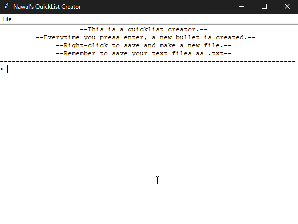

# QuickList
A Notepad++ mimicker written in Python.

I made this program to experiment a little with tkinter. It is quite simple.

  

  <src="demo/quicklistDemo.gif">

  

  

I've been meaning to look back at this and add a lot more. Maybe make a fully functional Notepad++ clone.
