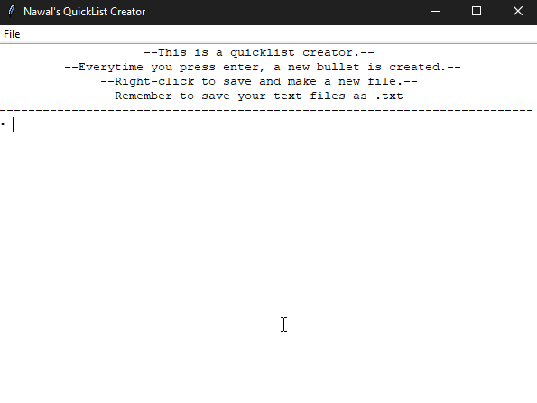

# QuickList
A Notepad++ mimicker written in Python.

I made this program to experiment a little with tkinter. It is quite simple.

div {
  box-shadow: 10px 10px 5px grey;
  

    
  

}

I've been meaning to look back at this and add a lot more. Maybe make a fully functional Notepad++ clone.
